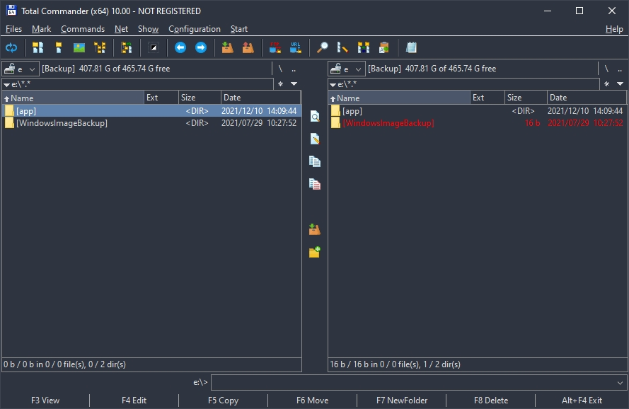
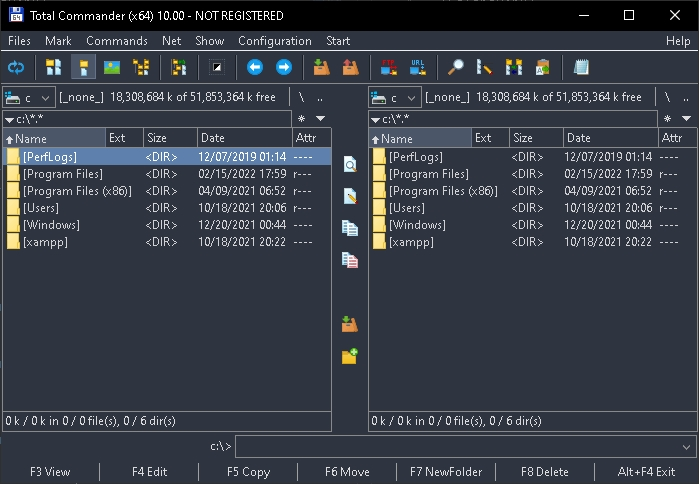

<h3 align="center">

[![Download][download-shield]][download-url]
[![Release][release-shield]][release-url]
[![Issues][issues-shield]][issues-url]
[![License][license-shield]][license-url]
</h3>

<!-- PROJECT LOGO -->
 

  <h1 align="center">:floppy_disk: Total Commander Nord Theme</h1>

  

    
     
    <a href="https://github.com/phamngocvinh/total-commander-nord/issues">Report Bug</a>
    ·
    <a href="https://github.com/phamngocvinh/total-commander-nord/issues">Request Feature</a>
  

<!-- TABLE OF CONTENTS -->

  
<h2 style="display: inline-block">Table of Contents</h2>

  <ol>
    <li><a href="#installation">Installation</a></li>
    <li><a href="#world_map-roadmap">Roadmap</a></li>
    <li><a href="#rocket-contributing">Contributing</a></li>
    <li><a href="#closed_book-license">License</a></li>
    <li><a href="#mailbox-contact">Contact</a></li>
    <li><a href="#books-acknowledgements">Acknowledgements</a></li>
  </ol>

<!-- Installation -->
## Installation

1. Download the latest [ColorNord.ini](https://github.com/phamngocvinh/total-commander-nord/releases/latest)
2. Locate wincmd.ini
Go to Menu -> Help -> About Total Commander... -> Settings files

3. Edit wincmd.ini

- If [ColorsDark] block exists, replace it with new content from ColorNord.ini
- If [ColorsDark] block not exists, add content from ColorNord.ini to the end of file

4. Switch to Dark Mode
Go to Menu -> Configuration -> Dark<>Normal

<!-- ROADMAP -->
## :world_map: Roadmap

See the [open issues](https://github.com/phamngocvinh/total-commander-nord/issues) for a list of proposed features (and known issues).

<!-- CONTRIBUTING -->
## :rocket: Contributing

Contributions are what make the open source community such an amazing place to learn, inspire, and create. Any contributions you make are **greatly appreciated**.

1. Fork the Project
2. Create your Feature Branch (`git checkout -b feature/AmazingFeature`)
3. Commit your Changes (`git commit -m 'Add some AmazingFeature'`)
4. Push to the Branch (`git push origin feature/AmazingFeature`)
5. Open a Pull Request

<!-- LICENSE -->
## :closed_book: License

Distributed under the GPL-3.0 License. See `LICENSE` for more information.

<!-- CONTACT -->
## :mailbox: Contact

[![Mail][mail-shield]][mail-url]
[![LinkedIn][linkedin-shield]][linkedin-url]

Project Link: [https://github.com/phamngocvinh/total-commander-nord](https://github.com/phamngocvinh/total-commander-nord)

<!-- ACKNOWLEDGEMENTS -->
## :books: Acknowledgements

* [Nord Theme Palettes](https://www.nordtheme.com)
* [Shields.io](https://shields.io)

<!-- MARKDOWN LINKS & IMAGES -->
<!-- https://www.markdownguide.org/basic-syntax/#reference-style-links -->
[download-shield]: https://img.shields.io/github/downloads/phamngocvinh/total-commander-nord/total?style=for-the-badge&labelColor=4c566a&color=5e81ac&logo=github&logoColor=white
[download-url]: https://github.com/phamngocvinh/total-commander-nord/releases/latest
[release-shield]: https://img.shields.io/github/v/release/phamngocvinh/total-commander-nord?style=for-the-badge&labelColor=4c566a&color=5e81ac&logo=Battle.net&logoColor=white
[release-url]: https://github.com/phamngocvinh/total-commander-nord/releases/latest
[issues-shield]: https://img.shields.io/github/issues/phamngocvinh/total-commander-nord?style=for-the-badge&labelColor=4c566a&color=5e81ac&logo=Todoist&logoColor=white
[issues-url]: https://github.com/phamngocvinh/total-commander-nord/issues
[license-shield]: https://img.shields.io/github/license/phamngocvinh/total-commander-nord?style=for-the-badge&labelColor=4c566a&color=5e81ac&logo=AdGuard&logoColor=white
[license-url]: https://github.com/phamngocvinh/total-commander-nord/blob/master/LICENSE
[linkedin-shield]: https://img.shields.io/badge/linkedin-blue?style=for-the-badge&logo=linkedin
[linkedin-url]: https://www.linkedin.com/in/phamngocvinh932
[mail-shield]: https://img.shields.io/badge/Gmail-white?style=for-the-badge&logo=gmail
[mail-url]: mailto:phamngocvinh@live.com
